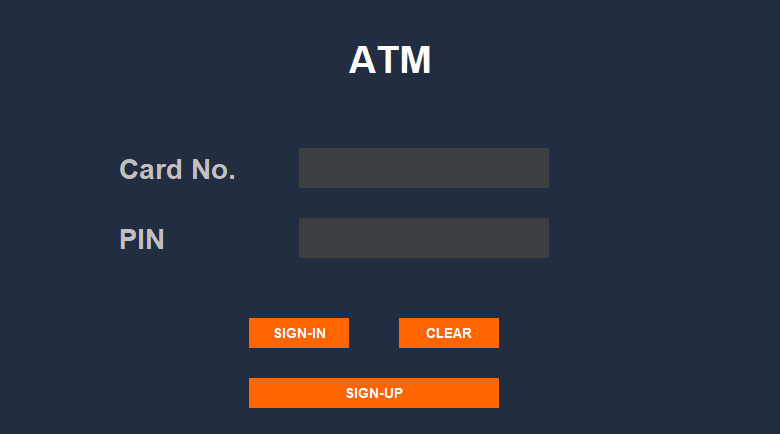
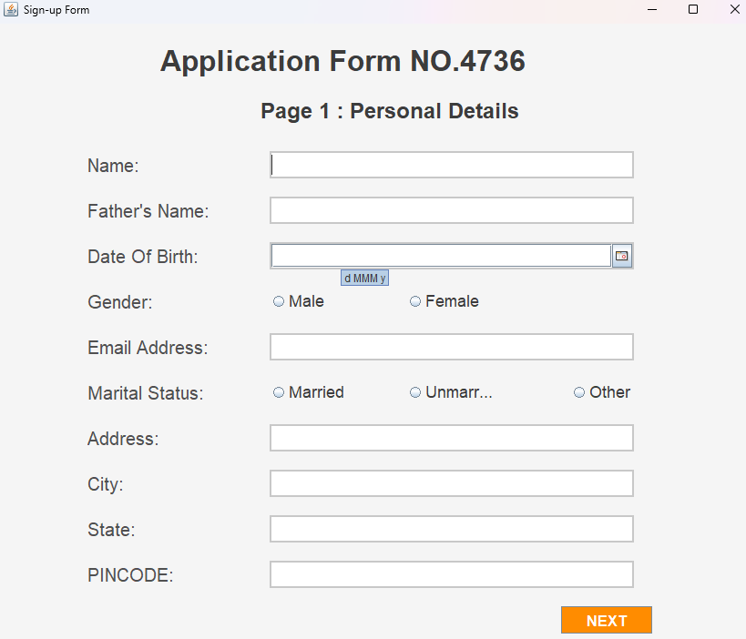
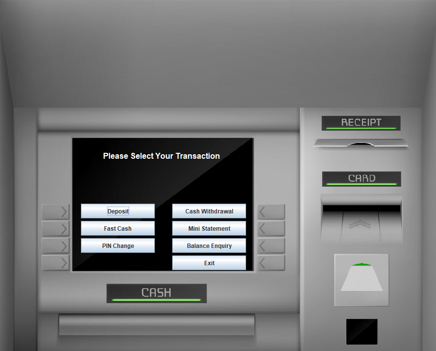

# ATM Simulator Application

## About the Project
This ATM Simulation Application is built using Java, Swing for the graphical user interface, and SQL for database management. The application connects to a MySQL database via JDBC. It provides users with functionalities similar to an actual ATM, including balance inquiry, deposit, withdrawal, and transaction history. The application is structured to simulate real-world banking processes securely and efficiently.

## Installation Steps

1. **Clone the Repository or Download Zip:**
   - Clone this repository using `git clone https://github.com/CodeDevvv/ATMSystemSimulator.git`, or download the zip file and extract it.

2. **Add Required Libraries:**
   - After downloading/cloning, ensure to include the following JAR files in your project from the `lib` folder:
     - `jcalendar.jar`
     - `mysql-connector.jar`

3. **Database Setup:**
   - Refer to `databaseSteps.txt` for detailed instructions on creating the necessary database and tables required for this project.

4. **Database Configuration:**
   - Once the database is created, navigate to the `src` folder and open `Conn.java`. 
   - In `Conn.java`, update the database name, username, and password with your MySQL credentials to establish the connection. 
   - Make sure MySQL is installed and running locally.

5. **Running the Application:**
   - To start the application, run the `Login.java` file. This will launch the ATM simulator's login screen, and you can proceed with the functionalities provided.

## Screenshots

1. **Login Screen:**

   

2. **Sign-Up Screen:**

   

3. **ATM Simulator Screen:**

   
